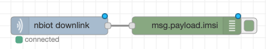

# node-red-contrib-nbiot-connector

__A plugin for Node-RED for easy connection to mm1 Technology NB-IoT connector__

## Description

Connects to NB-IoT relay service from mm1 Technology for easy access and integration of NB-IoT devices.
For more information please visit https://www.mm1-technology.de

*ATTENTION: Need a subscription to NB-IoT relay service and client library on IoT device to work*

## Setup

### Node-RED

A good documentation on how to install and use Node-RED can be found at the official Node-RED website: https://nodered.org/docs/getting-started/installation

### NB-IoT Connector

Via the Node-RED menu 'palette' new plugins cann be installed and remove. Simply open the menu, chose the install tab and type 'nbiot' into the search. The nbiot connector should be the first entry.

After successful installation two new nodes are visible:

To connect to the NB-IoT Relay Service you need the url of the relay service and your api key ! 

There is a config node so that one configuration can be used by multiple nodes.

If the Relay Service receives messages from your devices they will pushed to the downlink node and received in your flow as msg.payload.

## downlink message structure

    { 
       imsi: "{device imsi}", 
       data: "{raw payload}", 
       timestamp: “{timestamp of receiption}“,  
       direction: "{uplink/downlink}" 
    }

The minimum amount of nodes required to illustrate the received data looks as such(nbiot downlink and debug nodes):

Fill in the url and api token field of the 'nbiot downlink' node that pops up after clicking on the icon demonstrated in the next picture:

After saving, the nodes automatically connect to the relay service.

The raw data can be decoded for better usage and parsed to JSON:

    let msgStr = new Buffer(data.data, 'base64').toString("ascii");
    let msgJSON = JSON.parse(msgStr);
    
    
## uplink message structure

sending a message is quit easy. Simply create a json containing the imsi and the message:

    { 
       "imsi": 123456789,
       "message": "LED=1"
    }
    
and pass it to the uplink node.